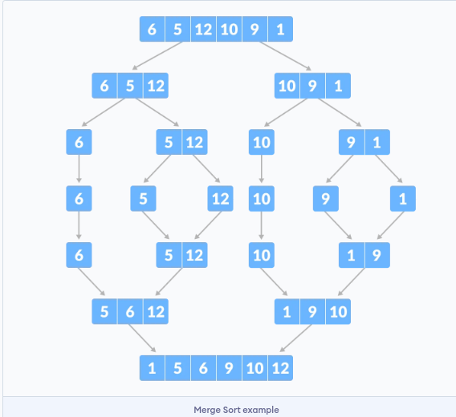
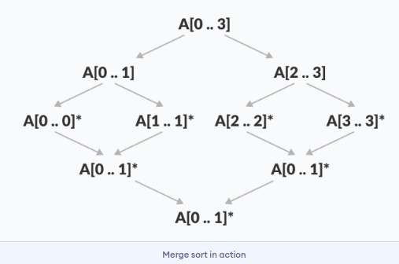
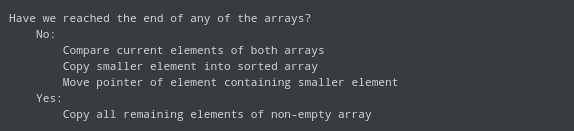
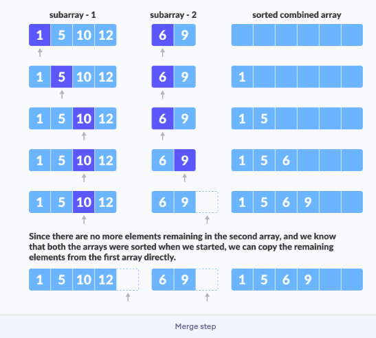

# Divide and Conquer Algorithm
- A divide and conquer algorithm is a strategy of solving a large problem by:
  - **Divide**: Breaking the problem into smaller sub-problems.
  - **Conquer**: Solving the sub-problems.
  - **Combine**: Combining them to get teh desired output.
- To use the divide and conquer algorithm, recursion is used.

 ## Advantage of Divide and Conquer Algorithm
 - The complexity of multiplying two matrices reduce from O(n^3) to O(n^2.8).
 - This approach also simplifies other problems, such as Tower of Hanoi.
 - This approach is suitable for multiprocessing systems.
 - It makes efficient use of memory caches.
  
 ## Divide and Conquer Applications
 - Binary search
 - Merge sort
 - Quick sort
 - Karatsuba mulitplication
 - Stassens's matrix multiplication

 ## Time complexity
 - The complexity of the divide and conquer algoritm is calculated using the master theorem.
  ```
    T(n) = aT(n/b) + f(n),
    where,
    n = size of input
    a = number of subproblems in the recursion
    n/b = size of each subproblem. All subproblems are assumed to have the same size.
    f(n) = cost of the work done outside the recursive call, which includes the cost of dividing the problem and cost of merging the solutions
  ```
- For a merge sort, the equation can be written as:
  ```
    T(n) = aT(n/b) + f(n)= 2T(n/2) + O(n)
    Where, 
    a = 2 (each time, a problem is divided into 2 subproblems)
    n/b = n/2 (size of each sub problem is half of the input)
    f(n) = time taken to divide the problem and merging the subproblems
    T(n/2) = O(n log n) (To understand this, please refer to the master theorem.)

    Now, T(n) = 2T(n log n) + O(n)
            ≈ O(n log n)
  ```

  ## Binary Search
  - BS is a searching algorithm for **finding an element's position in a sorted array**.
  - In this approach **the element is always searched in the middle of a portion of an array**.
  - Binary search algorithm can be implemented in two ways:
    - Iterative Method.
    - Recursive Method.
  - Solution steps:
    - Given an initial array = [3,4,5,6,7,8,9]. Let `x=4` be the element to be searched.
    
    - We set two pointers low and high at the lowest and the highest positions respectively.
     
    - We find the middle element `mid` of the array ie `arr[(low+high)/2]=6`.
    
    - If `x==mid`, then return mid.Else, compare the element to be searched with m.
      
    - If `x>mid`, compare `x` with the middle element of the elements on the right side of `mid`. This is done by setting `low` to `low=mid+1`.
    
    - Else compare `x` with the middle element of the elements on the left side of `mid`. This is done by setting `high` to `high=mid-1`  
      
    - We have to repeat steps 3 to 6 until low meets high.<br>
      
    - `x=4` if found.<br>
      

    ## Iterative approach
    ```
    do until the pointers low and high meet each other.
    mid = (low + high)/2
    if (x == arr[mid])
        return mid
    else if (x > arr[mid]) // x is on the right side
        low = mid + 1
    else                       // x is on the left side
        high = mid - 1
    ```

    ## Binary approach
    ```
    binarySearch(arr, x, low, high)
    if low > high
        return False 
    else
        mid = (low + high) / 2 
        if x == arr[mid]
            return mid
        else if x > arr[mid]        // x is on the right side
            return binarySearch(arr, x, mid + 1, high)
        else                               // x is on the right side
            return binarySearch(arr, x, low, mid - 1)
    ```
  ## Merge Sort Algorithm (in short)
    - Here a problem is divided into multiple sub-problems.
    - Each sub-problem is solved individually.
    - Finally sub-problems are combined to form the final solution.
     

  ## Divide and Conquer Strategy
  Suppose we had to sort an array `A`. A subproblem would be to sort a sub-section of this array starting at index `p` and ending at index r, denoted as `A[p..r]`.
  - **Divide:**
    - If q is the half-way point between p and r, then we can split the subarray `A[p..r]` into two arrays `A[p..q]` and `A[q+1,r]`.
  - **Conquer:**
    - We try to sort both the subarrays `A[p..q]` and `A[q+1,r]`.
    - If we haven't yet reached the base case, we again divide both these subarrays and try to sort them.
  - **Combine:**
    - When the conquere step reaches the base step and we get two sorted subarrays `A[p..q]` and `A[q+1,r]` for array `A[p..r]`, we combine the results by creating a sorted array `A[p..r]` from two sorted subarrays `A[p..q]` and `A[q+1,r]`. 

  ## MergeSort Algorithm
  - The MergeSort function repeatedly divides the array into two halves until we reach a stage where we try to perform MergeSort on a subarray of size 1 i.e. `p==r`.
  - After that, the merge function comes into play and combines the sorted arrays into larger arrays until the whole array is merged.
  ```
  MergeSort(A, p, r):
    if p > r 
        return
    q = (p+r)/2
    mergeSort(A, p, q)
    mergeSort(A, q+1, r)
    merge(A, p, q, r)
  ``` 
  - To sort an entire array, we need to call `MergeSort(A, 0, length(A)-1)`.
   
  - As shown in the image the merge sort algorithm recursively divides the array into halves untill we reach the base case of array witn 1 element. 

  ## The merge step of Merge Sort
  - The most important part of the merge sort algorithm is `merge` step.
  - The merge step is the solution to the simple problem of merging two sorted lists(arrays) to build one large sorted list(array).
  - The algorithm maintains three pointers, one for each of the two arrays and one for maintaining the current index of the final sorted array.
    
    